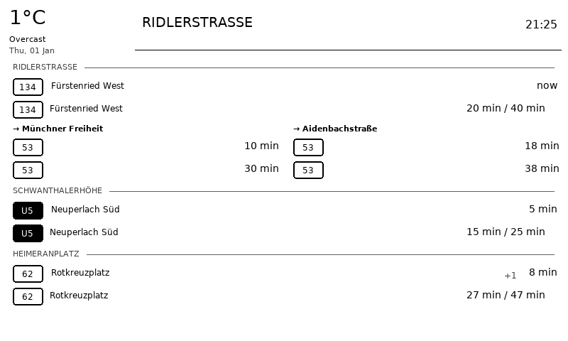
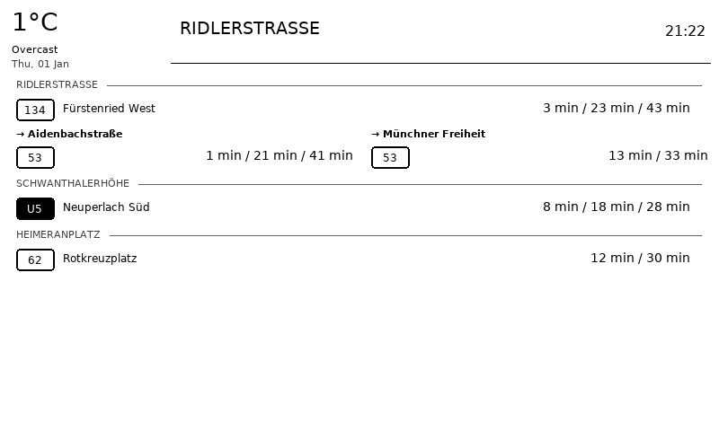

# MunichGlance

> This project was developed using **spec-driven development** with English as the primary language.
> Built by Coding Agent and workflow under human control with [VibeCoder Heretic](https://heretic.giglabo.com).

A self-hosted [TRMNL](https://usetrmnl.com/) BYOS (Bring Your Own Server) plugin that displays Munich public transport departures and current weather on a 7.5" e-ink display (800x480).

## Screenshots

| Default View (`compact_directions: false`) | Compact View (`compact_directions: true`) |
|:------------------------------------------:|:-----------------------------------------:|
|  |  |

**Default View** shows up to 2 rows per line with clear departure times. **Compact View** condenses all times into a single row per line, fitting more stations on screen.

## Features

- Real-time Munich transit departures from [MVG API](#mvg-api)
- Current weather from [Open-Meteo](#open-meteo-weather-api) (no API key required)
- Multi-station support with line/direction filtering
- Optimized for 800x480 1-bit e-ink displays
- Configurable display modes (grouped/flat, compact/detailed)
- Dynamic refresh scheduling (faster during rush hours)
- Sleep mode for battery savings
- Docker deployment ready

## Quick Start

### Prerequisites

- Docker and Docker Compose (recommended) OR Python 3.11+
- A [TRMNL](https://usetrmnl.com/) e-ink display device

### Using Docker Compose (Recommended)

1. **Clone the repository**
   ```bash
   git clone https://github.com/giglabo/munich-glance.git
   cd munich-glance
   ```

2. **Copy and configure environment variables**
   ```bash
   cp .env.example .env
   ```

3. **Start the server**
   ```bash
   docker compose up -d
   ```

4. **Verify it's running**
   ```bash
   curl http://localhost:4567/api/health
   ```

5. **Configure your TRMNL device** to use:
   ```
   http://your-server-ip:4567
   ```

6. **View the dashboard** at http://localhost:4567

### Manual Installation

```bash
# Clone and enter directory
git clone https://github.com/giglabo/munich-glance.git
cd munich-glance

# Create virtual environment
python3 -m venv .venv
source .venv/bin/activate

# Install dependencies
pip install -e .

# Download fonts
./scripts/setup_fonts.sh

# Configure environment
cp .env.example .env

# Run the server
python -m trmnl_server
```

## Configuration

MunichGlance can be configured via environment variables (`.env`) or the YAML configuration file (`config/app-config.yaml`). The YAML file provides more advanced options.

### Basic Configuration (Environment Variables)

| Variable | Default | Description |
|----------|---------|-------------|
| `MVG_STATION_NAME` | `Marienplatz` | Station name to display departures for |
| `MVG_DEPARTURE_LIMIT` | `10` | Number of departures to show |
| `MVG_OFFSET_MINUTES` | `0` | Walking time to station (filters out departures you can't catch) |
| `MVG_TRANSPORT_TYPES` | `UBAHN,SBAHN,TRAM,BUS` | Transport types to include |
| `WEATHER_LAT` | `48.1351` | Weather location latitude |
| `WEATHER_LON` | `11.5820` | Weather location longitude |
| `REFRESH_TIME` | `120` | Seconds between device screen refreshes |

### Advanced Configuration (YAML)

Edit `config/app-config.yaml` for full control. The file supports environment variable substitution with `${VAR_NAME:default}` syntax.

#### Server Settings

```yaml
server:
  host: "0.0.0.0"          # Bind address
  port: 4567               # HTTP port
  debug: false             # Enable debug mode
  timezone: "Europe/Berlin" # IANA timezone
```

#### Device Settings

```yaml
device:
  refresh_time: 120        # Fallback refresh interval (seconds)
  api_key: "${SETUP_API_KEY:}"  # Optional device authentication
  friendly_id: "munich-glance"
  setup_message: "MunichGlance Dashboard"

  # Sleep mode (saves battery overnight)
  sleep_enabled: true
  sleep_start: "23:00"     # Enter sleep at 11 PM
  sleep_end: "06:30"       # Wake up at 6:30 AM
  sleep_image_path: "sleep-image.bmp"  # Custom sleep screen (optional)
```

#### Display Settings

```yaml
display:
  # Dithering for e-ink conversion
  # Options: none, floyd_steinberg (recommended), ordered
  dithering_mode: "floyd_steinberg"
```

#### MVG Transit Settings

```yaml
mvg:
  display_station: Ridlerstraße  # Header text
  departure_limit: 15            # Max departures to fetch
  offset_minutes: 0              # Walking time buffer
  max_minutes: 60                # Don't show departures >60 min away

  # Display options
  show_delays: true              # Show +X delay indicators
  show_platform: false           # Show platform/track numbers
  show_cancelled: true           # Show cancelled departures
  show_groups: true              # Group by station with headers
  compact_directions: false      # true: 1 row/line, false: 2 rows/line
  font_scale: 0.8                # Font size (0.8-1.2)
  time_format: "relative"        # "relative" (5 min) or "absolute" (14:32)

  refresh_interval: 60           # API fetch interval (seconds)
  cache_ttl: 30                  # Cache fallback duration
```

#### Multi-Station Configuration

Track departures from multiple stations with specific line/direction filters:

```yaml
departures:
  - station: Ridlerstraße
    filters:
      - type: BUS
        line: '53'
      - type: BUS
        line: '134'
        direction: Fürstenried West

  - station: Schwanthalerhöhe
    filters:
      - type: UBAHN
        line: U5
        direction: Neuperlach Süd

  - station: Heimeranplatz
    filters:
      - type: BUS
        line: '62'
        direction: Rotkreuzplatz
```

**Filter options:**
- `type`: Transport type (`UBAHN`, `SBAHN`, `TRAM`, `BUS`, `REGIONAL_BUS`, `BAHN`, `SCHIFF`)
- `line`: Line number/name (e.g., `'53'`, `U5`)
- `direction`: Destination filter (exact match or `auto` for opposite direction)

**No filters** = accept all departures from that station.

#### Weather Settings

```yaml
weather:
  latitude: 48.1351        # WGS84 coordinates
  longitude: 11.5820
  units: "celsius"         # celsius or fahrenheit
  refresh_interval: 900    # 15 minutes
  cache_ttl: 900
```

#### Dynamic Refresh Schedule

Adjust refresh intervals based on time of day:

```yaml
refresh_schedule:
  default: 120  # 2 minutes default

  # Weekdays: faster during rush hours
  mon: &weekday
    default: 120
    intervals:
      - time: "07:00-08:00"
        refresh: 60  # 1 minute during morning rush
      - time: "15:50-16:30"
        refresh: 60  # 1 minute during afternoon rush
  tue: *weekday
  wed: *weekday
  thu: *weekday
  fri: *weekday

  # Weekends: slower refresh
  sat:
    default: 600  # 10 minutes
  sun:
    default: 600
```

### Interactive Configuration CLI

Use the interactive CLI tool to configure multi-station departures:

```bash
# With virtual environment
python -m trmnl_server.cli.configure

# Or if installed via pip
munich-glance-configure
```

The CLI helps you:
1. Search for stations using fuzzy matching
2. Select transport types and lines
3. Configure directions (all, auto-opposite, or specific)
4. Generate ready-to-use YAML configuration

**Full documentation:** [Configure Departures Guide](docs/configure-departures.md)

## API Endpoints

| Endpoint | Description |
|----------|-------------|
| `GET /api/display` | Main TRMNL endpoint - returns current image |
| `POST /api/log` | Device event logging |
| `POST /api/battery` | Battery telemetry |
| `GET /api/health` | Health check |
| `GET /settings` | Current configuration |
| `GET /settings/plugins` | List registered plugins |
| `GET /docs` | OpenAPI documentation |

## Architecture

```
┌─────────────────┐     ┌──────────────────────────────────┐
│  TRMNL Device   │────▶│       BYOS FastAPI Server        │
│  (e-ink 800x480)│◀────│  ┌────────────┐  ┌────────────┐  │
└─────────────────┘     │  │ MVG Plugin │  │Weather Plug│  │
                        │  └─────┬──────┘  └─────┬──────┘  │
                        └────────┼───────────────┼─────────┘
                                 ▼               ▼
                           ┌─────────┐    ┌────────────┐
                           │ MVG API │    │ Open-Meteo │
                           └─────────┘    └────────────┘
```

### Project Structure

```
munich-glance/
├── trmnl_server/
│   ├── main.py              # FastAPI application
│   ├── config.py            # Server configuration
│   ├── routes/
│   │   ├── api.py           # TRMNL device endpoints
│   │   └── settings.py      # Settings management
│   ├── services/
│   │   ├── scheduler.py     # Background refresh
│   │   └── plugins.py       # Plugin discovery
│   └── plugins/
│       ├── base.py          # PluginBase class
│       └── munichglance/
│           ├── plugin.py    # Main plugin
│           ├── weather.py   # Open-Meteo client
│           ├── departures.py# MVG client
│           └── renderer.py  # Image generation
├── config/
│   └── app-config.yaml      # Main configuration file
├── var/
│   ├── db/                  # SQLite database
│   └── generated/           # Generated images
├── Dockerfile
├── docker-compose.yml
└── pyproject.toml
```

## Troubleshooting

### No departures showing
- Check station name is correct
- Verify transport types in configuration
- Check server logs: `docker compose logs -f munich-glance`

### Weather not displaying
- Verify coordinates are correct
- Check connectivity to api.open-meteo.com

### Image not updating
- Check `/api/health` endpoint
- Verify scheduler is running
- Restart: `docker compose restart`

## Development

This project was developed using **spec-driven development** - specifications and implementation plans were written first, then code was generated based on those specs.

### Running Tests

```bash
pip install -e ".[dev]"
pytest
```

### Code Quality

```bash
./scripts/format_code.sh  # Format code
./scripts/check_code.sh   # Run all checks
```

## API References & Disclaimers

### MVG API

This project uses the [mvg](https://pypi.org/project/mvg/) Python library to access Munich public transport data.

> **Disclaimer:** The MVG API is provided by Münchner Verkehrsgesellschaft for informational purposes. This project is **not affiliated with MVG**. The API is intended for **personal, non-commercial use only**. Please respect rate limits and terms of service. Data accuracy is not guaranteed - always verify departure times through official MVG channels for critical journeys.

### Open-Meteo Weather API

Weather data is provided by [Open-Meteo](https://open-meteo.com/), a free and open-source weather API.

> Open-Meteo offers free access for non-commercial use. No API key required. For commercial use or high-volume applications, please check their [pricing and terms](https://open-meteo.com/en/terms).

### TRMNL

This project is designed for use with [TRMNL](https://usetrmnl.com/) e-ink displays using their BYOS (Bring Your Own Server) protocol.

> TRMNL is a product of usetrmnl.com. This project is an independent, community-created plugin and is **not officially affiliated with or endorsed by TRMNL**.

## License

MIT License - See [LICENSE](LICENSE) file for details.

---

<p align="center">
  <a href="https://heretic.giglabo.com">
    
  </a>
  <br>
  <em>Built with <a href="https://heretic.giglabo.com">VibeCoder Heretic</a></em>
</p>
